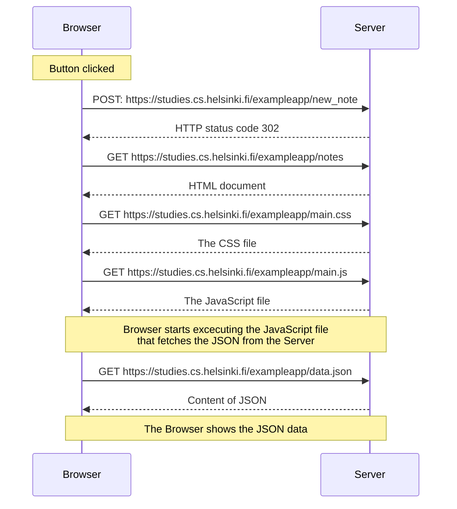

```mermaid
sequenceDiagram;
   participant Browser
   participant Server
   Note over Browser: Button clicked
   Browser ->> Server: POST: https://studies.cs.helsinki.fi/exampleapp/new_note
   Server -->> Browser: HTTP status code 302
   Browser ->> Server: GET https://studies.cs.helsinki.fi/exampleapp/notes
   Server -->> Browser: HTML document
   Browser ->> Server: GET https://studies.cs.helsinki.fi/exampleapp/main.css
   Server -->> Browser: The CSS file
   Browser ->> Server: GET https://studies.cs.helsinki.fi/exampleapp/main.js
   Server -->> Browser: The JavaScript file 
   Note over Browser,Server: Browser starts excecuting the JavaScript file <br>that fetches the JSON from the Server
   Browser ->> Server: GET https://studies.cs.helsinki.fi/exampleapp/data.json
   Server -->> Browser: Content of JSON
   Note over Browser,Server: The Browser shows the JSON data
```