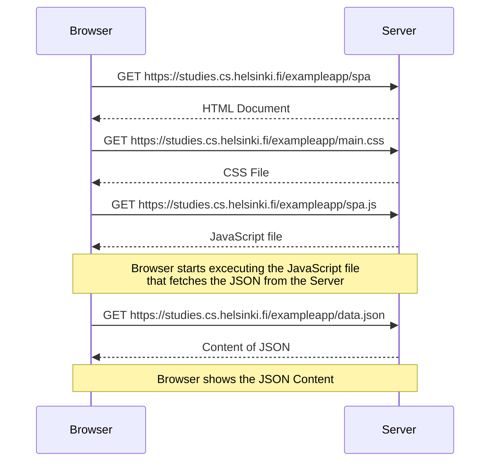

```mermaid
sequenceDiagram
    participant Browser
    participant Server
    Browser ->> Server: GET https://studies.cs.helsinki.fi/exampleapp/spa
    Server -->> Browser: HTML Document
    Browser ->> Server: GET https://studies.cs.helsinki.fi/exampleapp/main.css
    Server -->> Browser: CSS File
    Browser ->> Server: GET https://studies.cs.helsinki.fi/exampleapp/spa.js
    Server -->> Browser: JavaScript file
    Note over Browser,Server: Browser starts excecuting the JavaScript file <br>that fetches the JSON from the Server
    Browser ->> Server: GET https://studies.cs.helsinki.fi/exampleapp/data.json
    Server -->> Browser: Content of JSON
    Note over Browser, Server: Browser shows the JSON Content
```