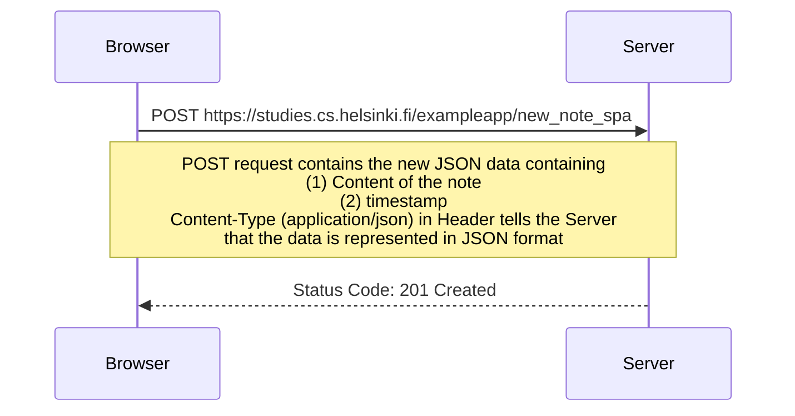

```mermaid
sequenceDiagram
    participant Browser
    participant Server
    Browser ->> Server: POST https://studies.cs.helsinki.fi/exampleapp/new_note_spa
    Note over Browser,Server: POST request contains the new JSON data containing <br> (1) Content of the note <br> (2) timestamp <br> Content-Type (application/json) in Header tells the Server <br> that the data is represented in JSON format
    Server -->> Browser: Status Code: 201 Created
```